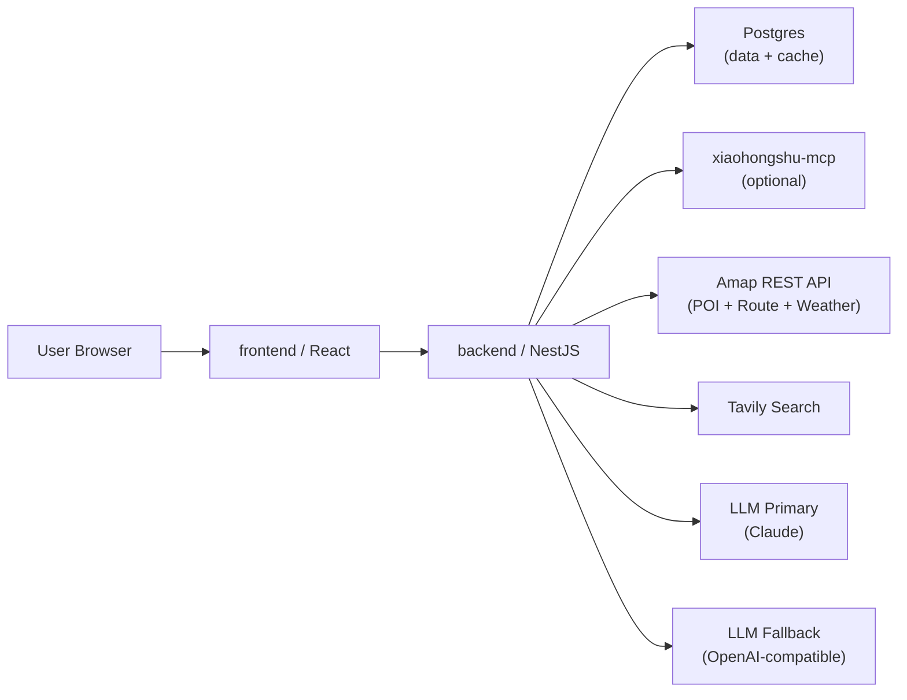

# OPTIMIZED FULL STACK ARCHITECTURE

> 版本：v2
> 创建日期：2026-07-12
> 基于：`BACKEND&FRONTEND_ARCHITECTURE.MD`（v1 基线保留，不删除）
> 背景：参考 hello-agents trip-planner 项目及网络最佳实践，对研究管道、Provider 层、前端体验进行系统性优化。

---

## 1. 架构定位

TravelAssistant 采用标准前后端分离架构：

- `frontend/`：React + TypeScript 旅行工作台，含地图可视化与行程导出。
- `backend/`：NestJS + Fastify API 与 Agent 编排层。
- `postgres`：本地持久化（含 research 结果缓存表）。
- `xiaohongshu-mcp`：本地小红书 MCP 只读数据源（可选，支持降级）。

浏览器只访问本项目后端，不直接访问 MCP、高德、Tavily 或 LLM。

---

## 2. 服务拓扑



本地 Compose 服务：

| 服务                | 说明                                        |
| ------------------- | ------------------------------------------- |
| `web`             | Nginx 托管前端构建产物，代理`/api` 到后端 |
| `api`             | NestJS + Fastify，容器内监听`3000`        |
| `postgres`        | Postgres 16                                 |
| `xiaohongshu-mcp` | 按需启动（profile`xhs`）                  |

---

## 3. 后端目录边界

```text
backend/
  src/
    modules/
      config/          # 环境变量与配置管理
      database/        # PostgreSQL 连接
      health/          # 健康检查
      mcp/             # XHS MCP HTTP client
      providers/       # 外部服务抽象（见第4节）
      research/        # ReAct Agent 编排（见第5节）
      planner/         # 行程生成与版本化
      export/          # 行程导出（PDF）
      safety/          # XHS 工具白名单与安全边界
      trips/           # Trip CRUD
    filters/
      http-exception.filter.ts  # 全局统一错误格式
```

---

## 4. Provider 层（providers/）

### 4.1 AmapProviderService

从纯 POI 检索升级为地理服务套件，全部直连 Amap REST API（不使用 MCP）：

| 方法                             | 说明                       |
| -------------------------------- | -------------------------- |
| `searchPOI(keyword, city)`     | 地点搜索（原有）           |
| `geocode(address)`             | 地理编码（原有）           |
| `getWeather(city)`             | 实时天气 + 预报            |
| `getRoute(origin, dest, mode)` | 路线规划（驾车/步行/公交） |

### 4.2 LlmProviderService

增加 primary/fallback 多 provider 链，对上层透明：

```
Primary: OpenAI-compatible（DeepSeek / OpenAI / 本地模型 / Claude via OpenAI proxy）
    ↓ 失败（超时 / 限流 / 不可用）
Fallback: OpenAI-compatible（备用端点，如 DeepSeek / 其他兼容模型）
```

- 统一使用 OpenAI SDK 协议（`/v1/chat/completions`），不再依赖 Anthropic SDK
- Primary / Fallback 均通过 `base_url` + `api_key` + `model` 三元组配置，可指向任意兼容端点
- 配置通过环境变量 `LLM_PRIMARY_*` / `LLM_FALLBACK_*` 注入
- 单次请求失败自动切换，切换事件写入日志
- `chatCompletion` / `jsonCompletion` 接口不变，调用方无感知

### 4.3 TavilyProviderService

保持现状，封装 Tavily 网页搜索。

---

## 5. Research 管道（research/）— ReAct Agent 化

### 5.1 架构变更

原硬编码顺序（XHS → Tavily → Amap）改为 **ReAct Agent 循环**：

```
ResearchAgent
  工具集：
    - xhs_search(query)      # 小红书笔记搜索
    - web_search(query)      # Tavily 网页搜索
    - poi_search(keyword)    # Amap POI
    - get_weather(city)      # Amap 天气
    - get_route(from, to)    # Amap 路线

  循环：Thought → Action → Observation → ... → Final Sources
  最大轮次：8 轮（可配置）
```

LLM 自主决定追加哪些搜索，避免对每个目的地都跑全量 provider。

### 5.2 XHS 降级策略

```
XHS 不可用（登录态失效 / 超时 / MCP 未启动）
  → 日志记录降级原因
  → 自动退出 xhs_search 工具可用集
  → 继续以 Tavily + Amap 完成 research
  → 前端展示"小红书数据不可用，已使用备用来源"提示
```

降级不阻塞行程生成，不向前端抛出 500 错误。

### 5.3 Research 结果缓存

新增 `research_cache` 表（PostgreSQL）：

```sql
CREATE TABLE research_cache (
  id           UUID PRIMARY KEY DEFAULT gen_random_uuid(),
  cache_key    TEXT NOT NULL UNIQUE,  -- SHA256(destination + interests + duration)
  sources      JSONB NOT NULL,
  created_at   TIMESTAMPTZ DEFAULT NOW(),
  expires_at   TIMESTAMPTZ NOT NULL   -- TTL 7 天
);
CREATE INDEX ON research_cache (cache_key, expires_at);
```

命中缓存时跳过 Agent 循环，直接返回 sources；
未命中或已过期时执行 Agent 循环并回写缓存。

---

## 6. Planner 模块（planner/）

保持现有 LLM 单次 prompt → 结构化行程的方式（不改为 Agent 循环）：

- 以最新 research sources 作为证据
- 结果以不可变版本写入 `itinerary_versions`
- 新增：调用 `AmapProviderService.getRoute()` 为每日行程补充景点间路线与耗时
- 新增：调用 `AmapProviderService.getWeather()` 将天气信息注入行程建议

---

## 7. Export 模块（export/）

新增模块，支持将 `itinerary_versions` 导出为 PDF：

- 技术方案：后端 Puppeteer（headless Chrome）渲染 HTML → PDF
- API：`POST /export/itinerary/:versionId` → 返回 PDF 二进制流
- 不引入额外外部服务

---

## 8. 全局错误处理

新增 `HttpExceptionFilter`，统一所有 provider 错误的响应格式：

```json
{
  "statusCode": 500,
  "error": "PROVIDER_ERROR",
  "message": "Amap route request failed",
  "timestamp": "2026-07-12T01:25:39.634Z"
}
```

- Provider 内部错误不向前端暴露 API Key、请求头或原始响应
- XHS 降级事件返回 `200` + `degraded: true` 字段，而非错误码

---

## 9. 前端目录边界

```text
frontend/
  src/
    app/             # 路由、全局 Provider
    api/             # 后端 API client
    features/
      trip-form/       # 创建行程表单
      agent-run/       # Research 进度
      sources/         # 证据面板
      itinerary-editor/ # 行程编辑器
      itinerary-map/   # ★ 新增：Amap JS API 地图可视化
      itinerary-export/ # ★ 新增：导出入口（PDF下载）
    components/      # 共享 UI 组件（重新设计）
    store/           # ★ 新增：Zustand 全局状态
    hooks/           # React Query hooks
```

### 9.1 地图可视化（itinerary-map）

- 使用 Amap JS API 在地图上绘制行程 POI 标记与路线
- 与行程编辑器双向联动（选中某天高亮对应路线）
- POI 坐标由后端 planner 生成行程时一并返回

### 9.2 UI 重新设计

- 引入统一设计语言（色彩系统、字体、间距规范）
- 组件库：保留现有基础组件，全面重构样式
- 响应式布局支持中等屏幕（1280px+）

### 9.3 状态管理

- `Zustand`：全局同步状态（当前 trip、research 进度、XHS 降级提示）
- `React Query`：异步数据获取与缓存（itinerary versions、sources）

---

## 10. 安全边界（不变）

- API Key 只通过环境变量进入 `backend`
- `frontend` 不保存、不读取、不透传明文密钥
- XHS MCP 只允许白名单只读工具；`SafetyModule` 硬编码禁止写操作
- 健康检查只暴露配置项是否存在，不暴露值
- `.env`、MCP cookies 不提交仓库

---

## 11. 运行边界

本地开发：

```bash
npm run dev:backend
npm run dev:frontend
```

容器运行：

```bash
docker compose up --build                          # 不含 XHS MCP
docker compose --profile xhs up --build           # 含 XHS MCP
```

对外端口：

| 服务     | 端口                  |
| -------- | --------------------- |
| 前端     | `${WEB_PORT:-5173}` |
| 后端     | `${API_PORT:-3000}` |
| Postgres | `5432`              |
| MCP      | `18060`             |

---

## 12. 新增环境变量

| 变量                        | 说明                            |
| --------------------------- | ------------------------------- |
| `LLM_PRIMARY_BASE_URL`    | 主 LLM 端点                     |
| `LLM_PRIMARY_API_KEY`     | 主 LLM Key                      |
| `LLM_FALLBACK_BASE_URL`   | 备用 LLM 端点                   |
| `LLM_FALLBACK_API_KEY`    | 备用 LLM Key                    |
| `RESEARCH_CACHE_TTL_DAYS` | Research 缓存 TTL，默认`7`    |
| `RESEARCH_MAX_TURNS`      | ReAct Agent 最大轮次，默认`8` |
| `EXPORT_CHROME_PATH`      | Puppeteer Chrome 路径（可选）   |
