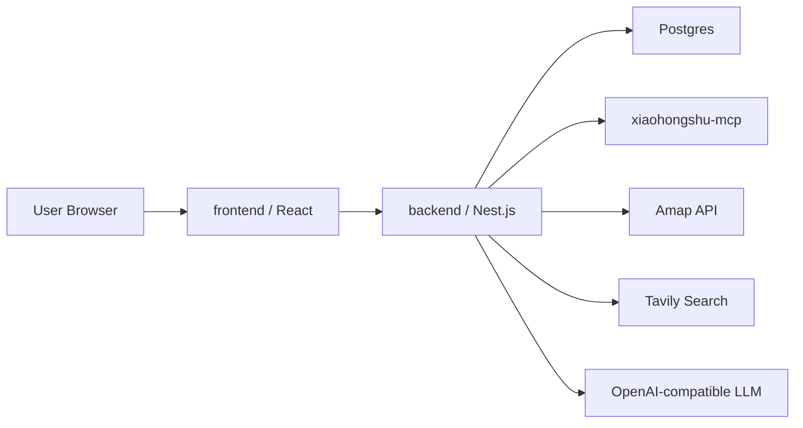

# BACKEND&FRONTEND_ARCHITECTURE

## 1. 架构定位

TravelAssistant 采用标准前后端分离架构：
- `frontend/`：React + TypeScript 旅行工作台。
- `backend/`：Nest.js + TypeScript API 与 Agent 编排层，HTTP adapter 使用 Fastify。
- `postgres`：本地持久化。
- `xiaohongshu-mcp`：本地小红书 MCP 只读数据源。

浏览器只访问本项目后端，不直接访问 MCP、高德、Tavily 或 LLM。

## 2. 服务拓扑



本地 Compose 服务：
- `web`：Nginx 托管前端构建产物，并代理 `/api` 到后端。
- `api`：Nest.js + Fastify 服务，监听容器内 `3000`。
- `postgres`：Postgres 16。
- `xiaohongshu-mcp`：`xpzouying/xiaohongshu-mcp:latest`，通过 Compose profile `xhs` 按需启动。

## 3. 目录边界

```text
backend/
  src/
    modules/
      config/
      health/

frontend/
  src/
    app/
    features/
      agent-run/
      itinerary-editor/
      sources/
      trip-form/
    api/
```

后续后端模块应继续放在 `backend/src/modules/` 下，例如：
- `mcp/`
- `llm/`
- `map/`
- `search/`
- `safety/`
- `trips/`
- `planner/`

## 4. 安全边界

- API Key 只通过环境变量进入 `backend`。
- `frontend` 不保存、不读取、不透传明文密钥。
- 小红书 MCP 首版只允许只读工具。
- 健康检查只暴露配置项是否存在，不暴露配置值。
- 后端首版使用 Fastify adapter，避免引入当前不需要的 Express/Multer 文件上传链。
- `.env`、MCP cookies、运行缓存和图片目录不提交到仓库。

## 5. 运行边界

本地开发：
- 后端：`npm run dev:backend`
- 前端：`npm run dev:frontend`

容器运行：
- `docker compose up --build`

对外端口：
- 前端：`${WEB_PORT:-5173}`
- 后端：`${API_PORT:-3000}`
- Postgres：`5432`
- MCP：`18060`

Apple Silicon 说明：
- `xiaohongshu-mcp` 当前按 `linux/amd64` 运行。
- 默认 `docker compose up` 不启动 MCP；需要完整小红书能力时使用 `docker compose --profile xhs up --build`。
